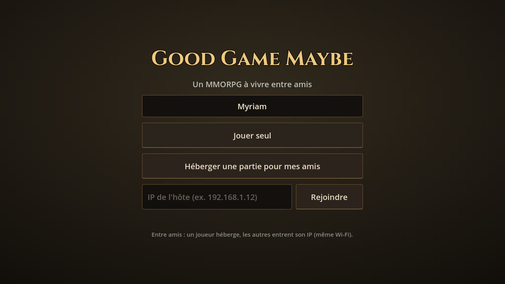
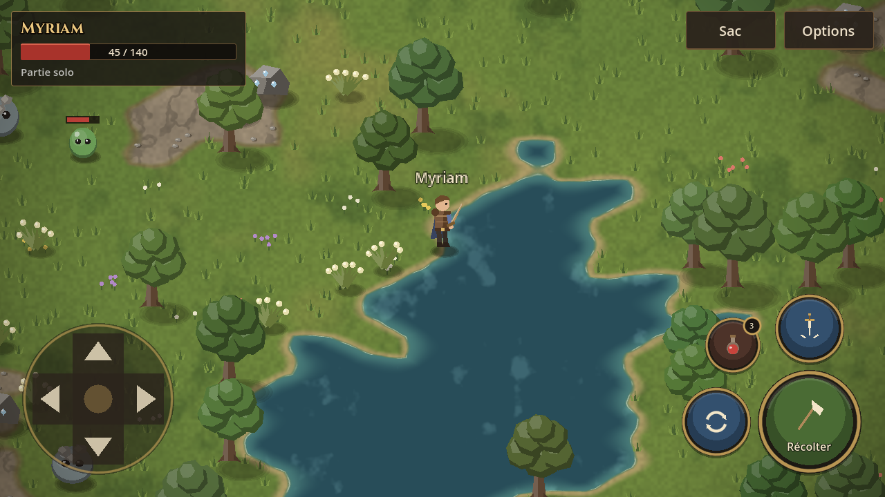
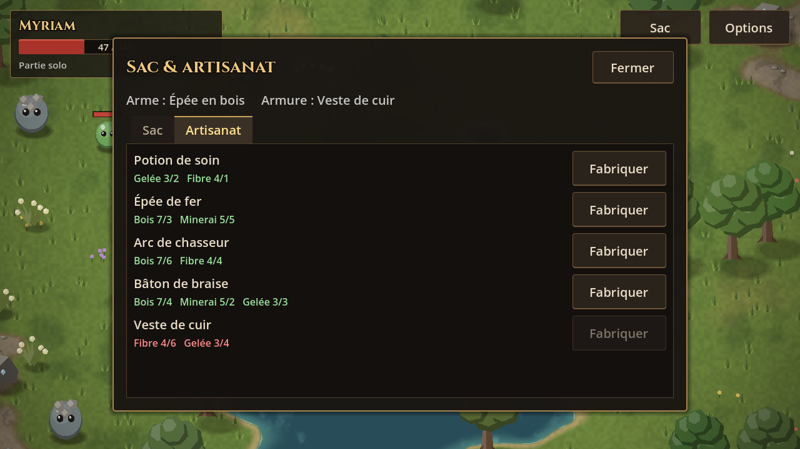

# good-game-maybe

MMORPG 2D isométrique **à jouer entre amis**, d'abord sur **mobile**.
Le combat et l'artisanat s'inspirent d'Albion Online, les commandes de Guardian Tales,
et l'univers en ligne de Dofus. Voir [DESIGN.md](DESIGN.md) pour la vision du jeu.


**Style graphique inspiré d'Albion Online** : sol peint sans quadrillage, formes « low-poly »
à facettes, couleurs naturelles, lumière douce et ombres de nuages, interface sombre à
liserés dorés. Tout est dessiné par le code et des shaders (aucune image d'Albion n'est utilisée).

## Ce qu'on peut faire

- **Combattre** des slimes et des slimes de roche, en temps réel avec visée automatique.
- **C'est l'arme qui fait la classe** (comme Albion) : épée, arc ou bâton, avec 3 compétences chacun.
- **Récolter** du bois, du minerai et de la fibre, et récupérer la gelée des monstres.
- **Fabriquer** des armes, une armure et des potions, puis s'équiper depuis le sac.
- **Jouer à plusieurs** : un joueur héberge depuis son téléphone et ses amis le rejoignent.
  La progression est sauvegardée chez l'hôte.

| Menu | Au camp | Artisanat |
|---|---|---|
|  |  |  |

## Lancer le jeu

1. Installer [Godot 4.3+](https://godotengine.org/download) (version standard, pas .NET).
2. Ouvrir Godot → **Importer** → choisir `project.godot`.
3. Appuyer sur **F5**.

### Sur Android

Le preset **Android** est prêt dans `export_presets.cfg`. Dans Godot :
**Éditeur → Gérer les modèles d'export** (installer les modèles), configurer le SDK Android
(**Éditeur → Paramètres de l'éditeur → Export → Android**), puis **Projet → Exporter → Android**.

## Jouer entre amis

1. Tout le monde est sur le **même Wi-Fi**.
2. Un joueur touche **« Héberger une partie pour mes amis »**. Son IP s'affiche en haut à gauche.
3. Les autres entrent cette IP et touchent **« Rejoindre »**.

Pour jouer à distance, on peut lancer un **serveur dédié** (sur un PC ou un petit serveur en
ligne) en ouvrant le port UDP 7777 :

```sh
godot --headless --path . -- --server --port=7777
```

## Commandes (mobile)

| | |
|---|---|
| D-pad à gauche | Se déplacer (8 directions). Désactivable dans **Options** |
| Toucher la carte | Aller à cet endroit |
| Gros bouton rouge | Attaque de base (maintenir pour enchaîner). Devient **Récolter** près d'une ressource |
| Deux boutons ronds | Compétences de l'arme équipée |
| Bouton Potion | Boire une potion de soin |
| **Sac** | Inventaire, équipement et artisanat |

Sur PC, en attendant la version dédiée : flèches pour se déplacer, clic pour aller quelque part.

## Tests

```sh
# Partie solo : combat, récolte, artisanat, équipement, D-pad, multi-touch…
godot --headless --path . -s res://tests/run_tests.gd

# Réseau : un serveur, puis un ou plusieurs clients
godot --headless --path . -- --server --port=7791 &
godot --headless --path . -s res://tests/network_client_test.gd -- --port=7791 --name=Alice
```

## Structure

```
scenes/             Scènes Godot (menu, monde, joueur, monstre, ressource, HUD)
scripts/game_data.gd  Tout l'équilibrage : objets, armes, compétences, recettes, monstres
scripts/art.gd      Outils de dessin du style (facettes, ombres, lumière)
shaders/            Sol peint, vignettage
assets/fonts/       Police Cinzel (titres), licence SIL OFL
scripts/autoload    Settings (préférences) et Network (solo / hôte / client / serveur)
scripts/entities    Joueur, monstres, ressources, résolution du combat
scripts/world       Carte isométrique, monde (apparitions, butin, sauvegarde), effets
scripts/ui          HUD, D-pad, boutons et pictogrammes de compétence, sac, menu
tests/              Tests automatisés (sans affichage)
```
