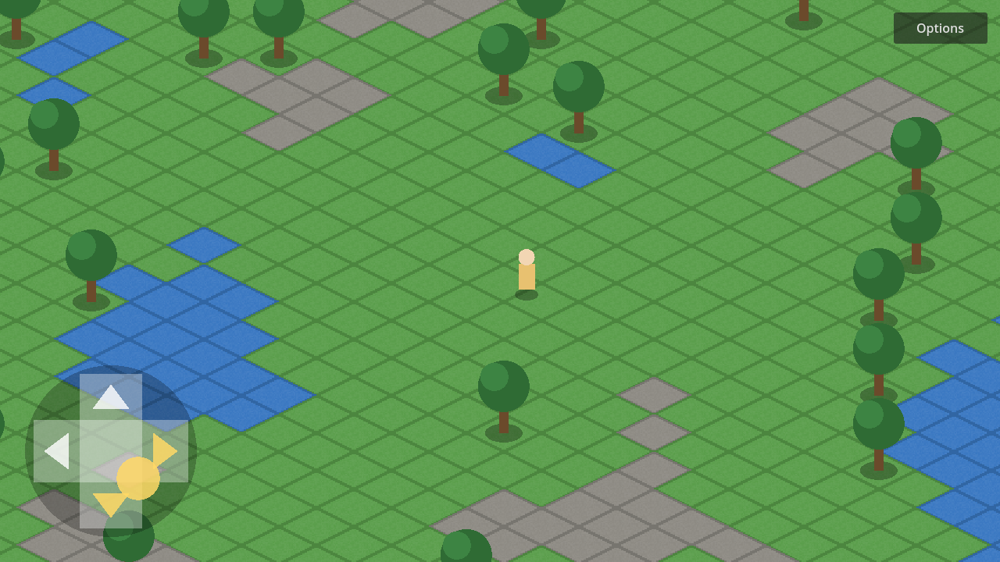

# good-game-maybe

MMORPG 2D isométrique pour jouer entre amis, inspiré d'Albion Online et de Dofus.
Combat en temps réel. **Priorité : la version mobile**, la version PC viendra ensuite. Voir [DESIGN.md](DESIGN.md) pour la vision du jeu.



## Lancer le jeu

1. Installer [Godot 4.3+](https://godotengine.org/download) (version standard, pas .NET).
2. Ouvrir Godot → **Importer** → choisir `project.godot`.
3. Appuyer sur **F5**.

## Contrôles

| | PC | Mobile |
|---|---|---|
| Se déplacer | ZQSD / WASD ou flèches | D-pad à l'écran (8 directions) |
| Aller à un endroit | Clic gauche (maintenir pour suivre la souris) | Toucher la carte |
| Options | Bouton **Options** en haut à droite | idem |

Le **D-pad** est activé par défaut sur les appareils tactiles. On peut l'activer ou le
désactiver dans **Options → D-pad tactile** (le choix est sauvegardé).

## Tests

```sh
godot --headless --path . -s res://tests/run_tests.gd
```

## Structure

```
scenes/           Scènes Godot (main, joueur, HUD, arbre)
scripts/autoload  Settings : préférences sauvegardées
scripts/world     Génération de la carte isométrique, scène principale
scripts/player    Déplacement du joueur
scripts/ui        HUD, D-pad virtuel
tests/            Tests automatisés (sans affichage)
```
